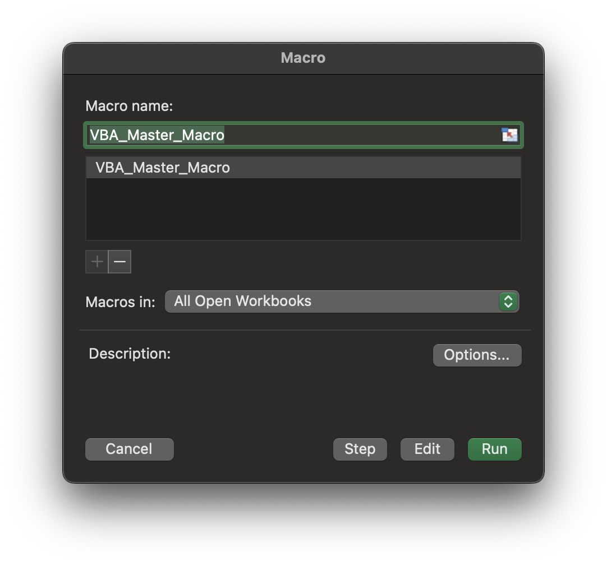

# VBA Data Processing Automation (Entegris Internship)

## Project Overview
This repository contains a visual summary of a VBA automation project developed during my Summer 2025 internship at Entegris. The project focused on automating the processing, analysis, and reporting of structured metrology data in Excel, dramatically improving efficiency and accuracy.

## What This Project Does
- **Automates Data Transformation:** Cleans, filters, and reshapes raw datasets into analysis-ready tables.
- **Performs Statistical Analysis:** Calculates sums, averages, standard deviations, and flags high-variance results.
- **Generates Dynamic Reports:** Creates parameterized, color-coded reports with embedded charts, each exported to its own workbook.
- **Error Handling:** Implements validation and logging to catch and report data anomalies.
- **Workbook Automation:** Programmatically generates and saves separate workbooks for each report request.

## Impact
- **Efficiency:** Reduced task time from ~38 minutes to under 3 minutes (over 1200% improvement).
- **Accuracy:** Eliminated manual entry errors and enforced uniform report styling.
- **Scalability:** Modular macros designed for reuse in other workflows.

## Included File
- `VBA_Master_Macro.png`: A screenshot of the main Excel macro interface, illustrating the automation workflow and report output.

## Usage
This repository is a visual and documentation reference for the VBA automation project. The actual VBA code is not included here, but the image and this README provide insight into the workflow and its impact.

For more details or to see the code, visit the main portfolio or contact me via [GitHub](https://github.com/Ryan-Cooley) or [LinkedIn](https://www.linkedin.com/in/ryancooley20/).

---

*Part of the [Ryan Cooley Portfolio](../RCPortfolio/index.html)* 